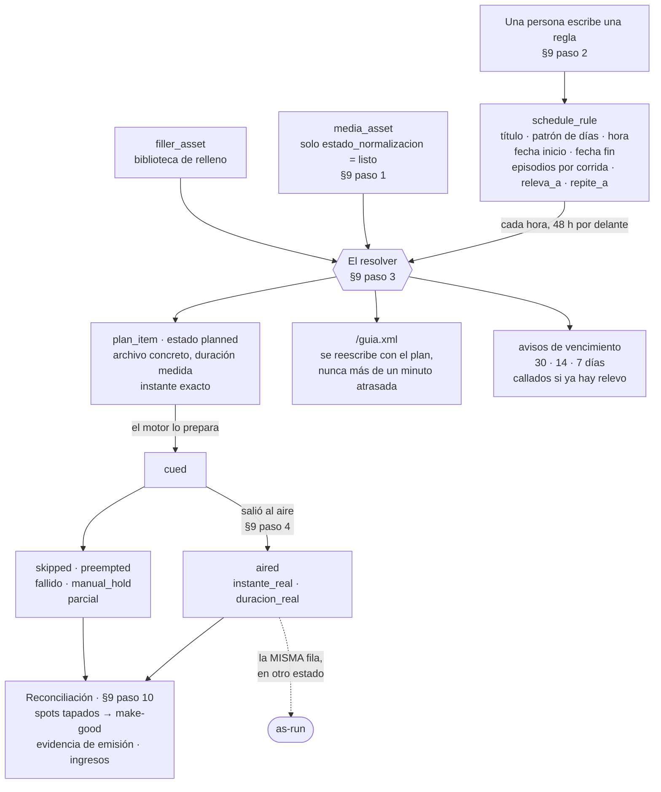
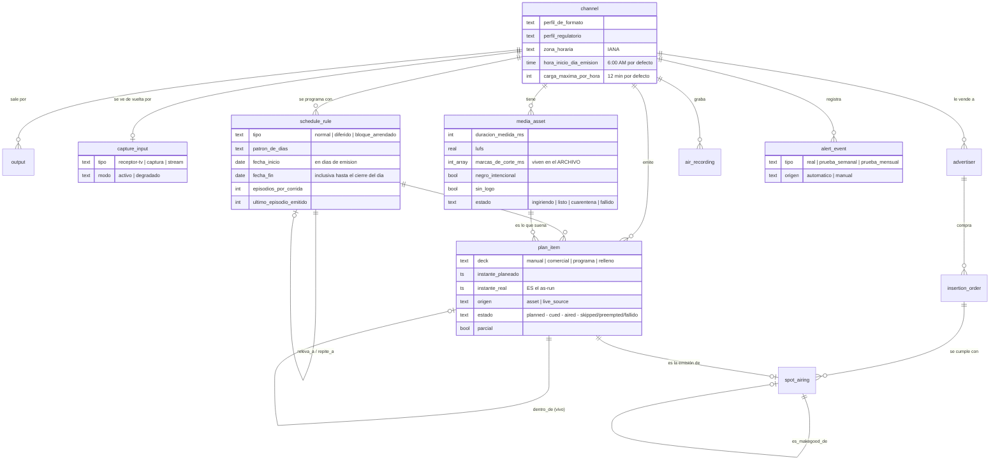

# La arquitectura de Antena787

Este documento es para quien va a escribir código. No explica qué hace el
producto —eso está en [`PRD.md`](../PRD.md)— sino **cómo está armado por
dentro y por qué**, para que un cambio no rompa algo que se decidió a
propósito.

**Dos advertencias antes de empezar.**

La primera: **casi nada de esto está construido todavía.** El proyecto está
en Fase 0 (§22.1) y lo único que existe es el motor mínimo del experimento.
Cada sección de abajo marca qué hay hoy en el repositorio y qué es **previsto,
no construido**. Si el documento y el código no coinciden, manda el código —
y lo que hay que corregir es el documento.

La segunda: **el vocabulario no se negocia.** [`CONTEXT.md`](../CONTEXT.md)
es la única fuente de los términos del dominio. El código, la interfaz y esta
documentación usan esas palabras y ninguna otra.

---

## Índice

- [a · Un proceso, un canal](#a--un-proceso-un-canal)
- [b · Los tres modos de trabajo: reglas → resolver → plan → as-run](#b--los-tres-modos-de-trabajo-reglas--resolver--plan--as-run)
- [c · El motor](#c--el-motor)
- [d · Los cuatro decks](#d--los-cuatro-decks)
- [e · Vivo, manual, grabación y diferido](#e--vivo-manual-grabación-y-diferido)
- [f · Los drivers](#f--los-drivers)
- [g · El retorno de aire](#g--el-retorno-de-aire-y-por-qué-la-verdad-se-mide-ahí)
- [h · El modelo de datos de un vistazo](#h--el-modelo-de-datos-de-un-vistazo)
- [i · El reloj](#i--el-reloj)
- [j · Qué se revisa línea por línea](#j--qué-se-revisa-línea-por-línea-y-qué-no)
- [k · La estructura de paquetes](#k--la-estructura-de-paquetes-la-prevista-y-la-de-hoy)
- [l · Lo que no hay y no va a haber](#l--lo-que-no-hay-y-no-va-a-haber)

---

## a · Un proceso, un canal

**`antena` es un solo binario y un solo proceso** (PRD §14.1). Dentro corren,
como goroutines, el servidor web, el resolver y el motor. No hay un demonio
de playout aparte, no hay servicio de streaming aparte, no hay Docker
obligatorio, no hay archivo de configuración.

**"Un proceso, un canal" quiere decir una instancia por canal** (§11), no un
motor separado del resto. Operar varias señales es una capa de administración
encima —libre como todo lo demás *(ADR [0006](adr/0006-support-not-features.md))*—
que comparte biblioteca, almacenamiento, anunciantes y grabación, mientras
cada canal conserva su parrilla, su plan, su proceso y sus salidas.

**Por qué un solo proceso.** Porque la promesa del producto es un archivo y
un instalador. Para el voluntario que corre un canal comunitario solo, "algo
falló en el otro servicio" no tiene arreglo — es el mismo argumento por el
que se descartó CasparCG *(ADR [0001](adr/0001-own-playout-engine-in-go.md))*.
Aislar el motor en otro proceso se reconsidera **solo si** la prueba de
resistencia de 30 días muestra que un fallo del servidor web tumba el aire.

**Y un solo proceso no puede significar que un error en cualquier rincón
saque el canal del aire.** Por eso, y esto es obligatorio para cualquier
goroutine que toque el aire:

- **Cada goroutine crítica —servidor de cuadros, watchdog, resolver— atrapa
  su propio pánico, registra un `incidente` y se relanza sola**, sin tumbar
  el proceso.
- El proceso corre bajo el supervisor del sistema —servicio de Windows o
  systemd— con reinicio automático. Si el reinicio ocurre, la recuperación es
  la de §14.1: todo `cued` vuelve a `planned`, el motor calcula qué debería
  estar al aire ahora y abre ese archivo **con seek al segundo correcto.
  Nunca reinicia el bloque desde cero.**
- **La memoria se vigila:** si el consumo pasa del umbral, suena la alarma
  **antes** de que el sistema operativo mate el proceso, no después.

*(Auditoría [A2](AUDITORIA_2026-09-04.md).)*

> **Estado: previsto, no construido.** Hoy el repositorio no tiene
> `cmd/antena/`, ni servidor web, ni resolver, ni base de datos. Lo único que
> corre es `cmd/f0`, el ejecutable del experimento.

---

## b · Los tres modos de trabajo: reglas → resolver → plan → as-run

Es la columna vertebral del sistema y la razón por la que nadie escribe 336
celdas. **Una regla es la intención; un plan es esa intención resuelta a
instante exacto; el as-run es el plan después de haber salido.**

Y el as-run **no es otra tabla: es la misma fila en otro estado** (§8). Lo
planeado queda intacto, lo real se llena al lado. Sin eso, la pantalla de
Guía —*"lo que dice la guía sobre lo que va a salir"*— y la métrica de
exactitud de la guía no se pueden calcular (§15).



**Lo que el resolver garantiza, y que un contribuidor no puede romper**
(§9 paso 3):

- **Se niega a programar una regla fuera de su rango de fechas**, y las
  fechas son **días de emisión**, no días de calendario: `fecha_fin` llega
  hasta el cierre del día de emisión —5:59:59 AM del calendario siguiente si
  el día empieza a las 6:00 AM.
- **Detecta conflictos de verdad** —solapes, regla vencida, archivo faltante
  o en cuarentena— **y entiende que un relevo no es un conflicto.**
- **Rellena todo hueco** con una combinación exacta de la biblioteca de
  relleno. Es un problema de empaquetado, determinista. Si no hay combinación
  exacta, se permite exceder hasta 5 segundos recortando **el último** clip de
  relleno del hueco, con un fundido de un segundo (§14.1).
- **Solo programa material listo para aire.** Un archivo que todavía se está
  normalizando no entra al plan; la cola de normalización se ordena por
  **cuándo sale al aire**.
- **El reloj manda sobre el contador de episodios.** Si el décimo episodio no
  termina antes del siguiente inicio duro, **no se arranca**: se rellena el
  resto y se avisa *"de 10 episodios caben 9"*. **Nunca se corta un episodio a
  la mitad porque no cupo.**
- **Un programa que cruza el inicio del día de emisión pertenece al día de su
  inicio.**
- **La restricción de solapes vive en el esquema**, no en el código de
  validación: dentro de un mismo deck y una misma salida no pueden existir
  dos `plan_item` con intervalos solapados (§15). El motor, además, si
  encuentra un solape en ejecución, reproduce el de menor `id` y registra
  `incidente.tipo=solape` — el cinturón además del tirante.

> **Estado: previsto, no construido.** `internal/resolver` no existe todavía.
> Es el corazón de la Fase 1; ver [`docs/ROADMAP.md`](ROADMAP.md).

---

## c · El motor

Es la pieza que la Fase 0 valida o tumba, y la única que ya existe en el
repositorio.

**El diseño, en una frase:** un `ffmpeg` decodifica cada clip a video crudo y
audio PCM, **un servidor de cuadros en Go** recibe esos cuadros, aplica el
conformado y entrega **un solo flujo continuo** a un **encoder persistente que
nunca muere** *(ADR [0001](adr/0001-own-playout-engine-in-go.md), PRD §14.1)*.

**Por qué así y no empalmando transport stream.** El empalme por copia de
flujo era el diseño original y tres investigaciones independientes lo
refutaron: los cuadros de video a 29.97 y los de audio a 48 kHz coinciden solo
cada ~21.36 segundos, así que un punto de corte arbitrario prácticamente nunca
alinea. Los tres proyectos que de verdad corren canales lineales 24/7
—ffplayout, Tunarr, ErsatzTV— decodifican y recodifican; ffplayout v2 se
reescribió justo para abandonar `-c copy`. El argumento a favor de aguantar
esa fragilidad era el costo de CPU, y se cayó: codificar por hardware mide
alrededor del 15 % del CPU en un N100 *(ADR 0001)*.

**Las tuberías con nombre quedaron descartadas**: no son portables entre
Windows y Linux (§14.1).

```mermaid
flowchart LR
    subgraph DEC["Un decodificador por clip — muere al terminar"]
        direction TB
        V["ffmpeg de video<br/>-an -sn -dn<br/>bwdif → scale → pad → fps<br/>→ rawvideo yuv420p"]
        A["ffmpeg de audio<br/>-vn -sn -dn<br/>aresample → estéreo<br/>→ s16le PCM"]
    end

    CLIP[("media_asset<br/>ya normalizado<br/>al formato de casa")] --> DEC

    DEC -->|"canal de cuadros<br/>= el pre-roll"| FS

    subgraph FS["Servidor de cuadros — Go, internal/engine/frameserver.go"]
        direction TB
        FS1["conformado por clip<br/>silencio si el audio queda corto<br/>sostener el último cuadro si el video queda corto"]
        FS2["pre-roll: el siguiente clip<br/>arranca antes de necesitarse"]
        FS3["pacing: un cuadro a su instante,<br/>ni antes ni después"]
        FS4["fundidos en cada borde de clip"]
        FS5["logo y crawl dibujados aquí<br/>PREVISTO, no construido"]
        FS6["eventos JSONL:<br/>corte · clip_corto · audio_corto<br/>cuadro_sostenido · atraso · relleno"]
    end

    FILL[("filler_asset<br/>cubre lo que el clip no dio")] --> FS

    FS -->|"dos conexiones TCP a 127.0.0.1<br/>video crudo y PCM, por separado"| ENC

    subgraph ENC["Encoder persistente — un solo ffmpeg que nunca muere"]
        direction TB
        E1["mpeg2-ts · MPEG-2 CBR<br/>mp2 + AC-3 · muxrate fijo<br/>PCR cada 20 ms · PAT/PMT 0.1 s"]
        E2["h264-ts · libx264 + AAC<br/>con su propio volumen"]
    end

    ENC --> O1["udp-ts → el multiplexor<br/>§10, prioridad 1"]
    ENC --> O2["archivo → lo que se mide"]
    ENC --> O3["internet: SRT · RTMP · HLS<br/>PREVISTO, no construido"]

    WD["Watchdog<br/>sin cuadro consumido en 3 s → cartel,<br/>mata y relanza con el mismo acelerador<br/>PREVISTO, no construido"] -.-> ENC
```



### Lo que ya existe en `internal/engine`

Son unas 785 líneas de Go, escritas para responder la pregunta del §22.1 y
nada más. Todo lo que no hacía falta para eso, no está.

**`format.go` — el formato de casa, y las muestras globales.**
`Format` es lo único que el encoder acepta: ancho, alto, tasa de cuadros como
fracción exacta (`60000/1001`), tasa de muestreo y canales. `CAtv` es el
formato del despliegue de referencia: 720p59.94, 48 kHz, estéreo.

Lo importante de este archivo es una función de tres líneas: **`SamplesUpTo(n)`
devuelve cuántas muestras de audio deben haberse entregado cuando se han
entregado `n` cuadros.** A 59.94 le tocan **800.8 muestras por cuadro** —una
fracción— y **es la única función que convierte cuadros a muestras**. Con ella
el desfase acumulado es cero por construcción; con un redondeo por cuadro,
serían 20 ms cada pocas horas. Ese es exactamente el error que el §16 describe
como "invisible en minutos y catastrófico al mes". **No la toques sin leer
§22.1.**

**`decoder.go` — dos `ffmpeg` por clip.**
Uno saca solo video (`-an -sn -dn`), otro solo audio (`-vn -sn -dn`). El
conformado de geometría y tasa va en el filtro de video: `bwdif` desentrelaza
**solo lo entrelazado**, `scale` con `force_original_aspect_ratio=decrease`
más `pad` da el pillarbox, y `fps` saca la tasa de casa aunque la fuente sea
PAL o de cuadros variables. El audio se remuestrea y se lleva a estéreo s16.
`ExpectedFrames` sale de la duración que reporta `ffprobe`, y es lo que
después permite saber que un clip se quedó corto. **`Close()` devuelve lo que
`ffmpeg` escribió en stderr**, que es el *por qué* de un archivo corrupto, y
va al evento — no se pierde.

**`frameserver.go` — el servidor de cuadros.** Es la pieza propia y la de más
riesgo. Hace, hoy:

- **Pre-roll:** antes de reproducir el clip actual ya lanzó el decodificador
  del siguiente. La capacidad del canal de cuadros *es* el pre-roll.
- **Pacing:** `emit` calcula el instante que le toca a cada cuadro y espera
  hasta él con un adelanto configurable (300 ms por defecto). Si va más de un
  segundo atrasado, registra el evento `atraso`. **Es el único punto que toca
  el encoder y el único que avanza el reloj del aire.**
- **Fundidos** de unos milisegundos en cada borde de clip, con un cuadro de
  anticipación en el video para saber que el que tiene en la mano es el
  último y fundir el audio antes de mandarlo.
- **Relleno y cuadro sostenido:** si el clip entrega menos cuadros de los que
  `ffprobe` prometió, se cubre la diferencia con el relleno; si el relleno
  mismo tampoco da nada, se sostiene el último cuadro. **Nunca se escribe
  negro** — y si un cuadro negro aparece en la salida, el analizador de F0 lo
  ve y eso es un fallo. Si el decodificador se atrasa a mitad de clip,
  `nextOrHold` sostiene el cuadro anterior y lo anota: **el aire no espera a
  nadie.**
- **Audio corto:** lo que falte se cubre con silencio, y si falta más de un
  cuadro se registra `audio_corto` con los milisegundos exactos. Unas pocas
  muestras al final son el codificador de la fuente y no valen un evento.
- **Eventos** en JSON por línea, cada uno con el cuadro y la muestra global
  donde ocurrió. Son los Incidentes del glosario en su forma de F0, y son lo
  que el analizador lee para saber dónde medir.

**`encoder.go` — el encoder persistente.** Un solo `ffmpeg` de larga vida que
recibe cuadros crudos y PCM y produce **todas las salidas a la vez**, cada una
con su propio ajuste de volumen — que es lo que el §7 pide cuando un canal sale
por transmisor y por internet al mismo tiempo. Hay dos clases construidas:

| `Kind` | Qué produce | Para qué |
|---|---|---|
| `mpeg2-ts` | MPEG-2 a tasa constante (`-b:v` = `-minrate` = `-maxrate`), audio **MPEG capa II y AC-3 a la vez**, TS con `muxrate` fijo, `pcr_period=20`, `pat_period=0.1`; con `tee` sale por UDP **y** a archivo | Lo que un multiplexor ATSC 1.0 exige (§10). Es la salida de CAtv |
| `h264-ts` | libx264 + AAC, con su propio bitrate y su propia ganancia | La salida de internet, para probar dos a la vez |

**Las entradas del encoder no van por stdin, sino por dos conexiones TCP a
`127.0.0.1`** que el proceso abre y `ffmpeg` conecta. El §14.1 dice "por su
stdin"; el código hace esto porque **hacen falta dos entradas** —video y
audio— y stdin es una sola, y porque las tuberías con nombre no son portables.
Es una divergencia deliberada del PRD, medida, y queda anotada aquí.

**`ffmpeg.go`** localiza el binario en este orden: `ANTENA_FFMPEG`, junto al
ejecutable, el PATH. En el release lo coloca el instalador junto al ejecutable
*(ADR [0003](adr/0003-one-bundled-binary.md))*.

### Las dos trampas de ffmpeg, documentadas

Las dos se aprendieron construyendo la F0 y están en
[`f0/README.md`](../f0/README.md). **Si alguien "limpia" el código sin
saberlas, el motor se traba.**

1. **Un solo `filter_complex` que mezcla audio y video se traba al tercer
   cuadro.** ffmpeg pide las entradas por marca de tiempo y se queda esperando
   al audio con el video bloqueado. Con **filtros por salida** (`-filter:a:0`)
   no pasa. Por eso el encoder se arma con `-map` y `-filter:a:N`, nunca con un
   grafo único.
2. **ffmpeg no abre su segunda entrada hasta haber leído algo de la primera.**
   Por eso el encoder **acepta la conexión de audio en una goroutine aparte y
   guarda en memoria lo que llegue antes** de que conecte, hasta un tope. Sin
   eso, el arranque se bloquea a sí mismo.

### Lo que del motor todavía no existe

Los cuatro decks · las fuentes en vivo · el modo manual · el logo y el crawl
dibujados en el servidor de cuadros · el watchdog del encoder · el detector de
silencio y negro sobre la salida · la cascada de respaldo hasta el cartel · la
grabación y el diferido · la señalización SCTE-104 · el reloj de pared y la
recuperación tras reinicio. Todo eso es **Fase 2**, y su orden interno está
fijado en el §22.3 del PRD: no se puede reordenar mucho y ninguno se puede
saltar.

---

## d · Los cuatro decks

Un canal no tiene una sola cola sino cuatro, y **en cada instante el aire lo
tiene el deck de mayor prioridad que tenga algo que poner** (§9 paso 4;
[`CONTEXT.md`](../CONTEXT.md), *Deck*):

```
manual      ← mientras el operador retiene el control
comercial   ← cuando toca un corte, a su hora de reloj
programa    ← la parrilla normal
relleno     ← cuando ninguno de los anteriores tiene nada
```

**Por qué cuatro colas y no una lista.** Porque tienen amos distintos: **la de
programa va por secuencia** —una canción termina y entra la siguiente— y **la
comercial va por reloj** —el spot vendido para las 8:00 tiene que salir entre
8:00 y 8:15. Meterlas en una sola lista obliga a recalcular todo cada vez que
algo dura distinto de lo previsto. Viene de cómo funciona la radio de verdad.

> **Cuidado al hablar con gente de radio:** en la automatización de radio
> "Deck A/B" suele significar dos reproductores que se cruzan. No es esto.
> Nombra la diferencia cuando expliques el sistema ([`CONTEXT.md`](../CONTEXT.md)).

**Dos cosas que un implementador se equivoca al asumir:**

**1. El deck manual no funciona por "tener algo que poner": funciona por
retención.** Mientras el operador tiene el control, el deck manual **retiene
el aire** aunque pasen diez minutos sin que nadie dispare nada, porque puede
haber una entrevista con el micrófono abierto. Por eso el temporizador de
seguridad **no mide si el operador dispara algo: mide si sale señal.**

**2. Qué le pasa al programa cuando el corte toma el aire depende de dónde
viene el programa:**

| Origen | Durante el corte | Después |
|---|---|---|
| **Archivo** | El programa **se pausa** | Reanuda donde iba. La duración del slot ya incluye los cortes, en los puntos de `marcas_de_corte_ms` — que son **propiedad del archivo, no de la emisión**, para que el diferido las respete igual |
| **Vivo** | La señal **sigue corriendo debajo** y esos minutos **se pierden** | Vuelve al vivo en el instante actual; el bloque **no se extiende**. Por eso los cortes deben caer donde la fuente también corta |

Y hay un tercer mecanismo que no es ninguno de los dos: **un ID de estación o
una cortinilla programados *dentro* de un bloque en vivo** son `plan_item` del
deck programa con `dentro_de` apuntando al bloque. Mientras suenan toman el
aire; al terminar, la señal en vivo regresa. **Los cortes vendidos dentro del
mismo bloque son deck comercial y se imponen por prioridad. Dos mecanismos
distintos, ambos válidos, y el modelo los distingue.**

> **Estado: previsto, no construido.** Es el paso 2 del §22.3.

---

## e · Vivo, manual, grabación y diferido

**Fuentes en vivo** *([§9 paso 5](../PRD.md#paso-5--una-fuente-en-vivo-entra)).*
El equipo de streaming **empuja a Antena787**, que escucha SRT o RTMP en la
red local, y de ahí sale al transmisor **y a la vez** a internet — la
dirección importa, porque si el transmisor jalara la señal desde YouTube, un
fallo de YouTube sacaría del aire a una estación licenciada. Se prefiere SRT
sobre RTMP por latencia (RTMP añade de 2 a 5 segundos). El bloque **reserva su
hora y se respeta completo aunque la señal llegue tarde, se caiga o no llegue
nunca**: dentro del margen de gracia se sostiene el cuadro o el cartel **sin
alarma**, pasado el margen entra el relleno y suena la alarma, el motor sigue
reintentando con espera progresiva, y cuando la señal vuelve el aire regresa
al vivo en el siguiente borde de clip de relleno. **El vivo pasa por el mismo
conformado que un archivo** — no hay ruta "cruda". Y puede ser **solo audio**:
entonces el video es el cartel del programa que dibuja el servidor de cuadros.

**Modo manual** *([§9 paso 6](../PRD.md#paso-6--alguien-toma-el-control-y-lo-suelta)).*
Todo corre en automático por defecto, y **nunca se queda en manual**. Se sale
de la retención por cuatro caminos: el operador la suelta, termina el bloque,
el sistema la suelta solo por **silencio o negro real en la salida** —no por
inactividad del ratón— o se cayó el sistema, que también se anota como motivo.
Antes del regreso forzado hay una **escalera visible** —cuenta regresiva
siempre a la vista, ámbar a 60 segundos, rojo y tono a 10—, porque la sorpresa
es lo que hace reaccionar mal a un humano bajo presión. **Hay un solo dueño
del control a la vez**, y quitárselo a otro se permite y queda registrado con
nombre y hora.

**Grabación** *([§9 paso 8](../PRD.md#paso-8--se-graba-la-salida-y-de-noche-se-retransmite)).*
Se graba lo que sale al aire, de corrido, **desde el retorno de aire y no
desde nuestra propia salida** (sección g). Sirve para tres cosas: la bitácora
de lo que de verdad se emitió, la base del driver `signal-compare`, y poder
retroceder para revisar sin dejar de ver el vivo. Retención de 7 días por
defecto, 30 si el disco alcanza, y **se comunica en días de historial, no en
gigabytes.**

**Diferido** *([§9 paso 8](../PRD.md#paso-8--se-graba-la-salida-y-de-noche-se-retransmite)).*
Es una regla más: *"de 1:00 a 6:00 AM, repite lo que salió de 7:00 AM a 12:00
PM."* Y **reprograma los archivos del plan; no reproduce la grabación** — por
tres razones que hay que tener presentes al implementarlo: los anuncios de la
mañana no se repiten (los cortes de la madrugada son **inventario nuevo**),
las alertas de emergencia grabadas no se retransmiten, y **nunca hay
recursión** porque el diferido solo toma `plan_item` del deck programa cuyo
origen fue un archivo. **Una ventana sin programa no produce diferido.** La
única excepción es el vivo: para ese tramo se usa la grabación, y sin sus
cortes.

> **Estado: previsto, no construido.** Pasos 5, 6 y 7 del §22.3.

---

## f · Los drivers

**El modelo de drivers es para quien contribuye. El usuario nunca ve la
palabra "driver"** (§10, §13). El asistente detecta, propone en lenguaje llano
y prueba: la pregunta es *"¿a dónde va tu señal?"*, nunca *"elige un driver"*.

Las familias, con su driver de referencia:

| Familia | Drivers |
|---|---|
| **Salida** | `red` (UDP-TS y RTP — **el primero que se construye**) · `internet` (RTMP/HLS/SRT) · `route-dash` (ATSC 3.0, futuro) · `archivo` · `ninguna` |
| **Entrada en vivo** | `srt-listen` (**el preferido, por latencia**) · `rtmp-listen` · `ninguna` |
| **Señalización de cortes** | `scte104-tcp` (la ruta primaria) · `gpi-out` · `hls-daterange` · `ninguna` |
| **Alertas de emergencia** | `gpi-serial` · `gpi-gpio` · `sage-endec` · `dasdec` · `syslog` · `snmp-trap` · `cap-poll` · **`signal-compare`** · `ninguna` |
| **Retorno de aire** | `receptor-tv` · `captura` · `stream` · `ninguno` |
| **Transmisor** (solo lectura) | `snmp` · `http` · `serial-usb` · `gpi-estado` · `ninguno` |
| **Respaldo** | `disco` · `red` · `nube` · `ninguno` |
| **Canal de avisos** | `telegram` · `whatsapp` · `correo` · `ninguno` |
| **Cobro del anunciante** | `stripe` · `ath-movil` · `mercado-pago` · `paypal` · `transferencia` · `efectivo` · `ninguno` |
| **Fichas y carátulas** | `tags-embebidas` · `nfo-local` · `caratula-embebida` · `coverart-archive` · `tvmaze` · `tmdb` · y los de clave propia con sus reservas |
| **Superposiciones** | `logo` · `clasificados` · `ninguna` |

**La regla que gobierna todas:**

> ### `ninguna` nunca miente.
>
> Si no hay forma de saberlo, el reporte lo dice en la cara en vez de fingir
> certeza. Un driver que no puede verificar algo **no reporta éxito**: reporta
> que no puede. Es la misma regla que pone a `signal-compare` en modo
> `degradado` cuando no hay retorno de aire, y la que hace que la salida UDP
> —que estructuralmente **no sabe si alguien la está escuchando**— no cuente
> como verificación de nada.

**Dos consecuencias de diseño que no son negociables.** La primera: **la
configuración de un driver vive en la tabla `driver_config` de SQLite, con las
credenciales cifradas — nunca en un archivo** (§15, principio 5). La segunda:
**nada se consulta en el momento de salir al aire.** Lo que un driver de
fichas descarga se guarda junto al archivo, una sola vez, en el ingest. **La
cadena de aire funciona con el internet caído.**

Cómo se añade uno: [`docs/drivers/README.md`](drivers/README.md).

> **Estado: previsto, no construido.** `internal/drivers/` no existe. Lo único
> que hay hoy es `engine.Output`, la estructura que describe una salida del
> encoder de F0 — que no es todavía la interfaz de un driver.

---

## g · El retorno de aire, y por qué la verdad se mide ahí

*(ADR [0009](adr/0009-truth-is-the-transmitted-signal.md).)*

**La verdad de lo que salió es la señal transmitida, no lo que nuestro proceso
creyó mandar.** La grabación, la reconciliación del as-run y el driver
`signal-compare` leen todos de un **retorno de aire** —la señal capturada
**después** del equipo de alertas de emergencia— y **nunca de la salida propia
del canal.**

**La alternativa era más barata: tomar los cuadros que ya tenemos camino al
encoder. Y es inútil justo para lo único que existe.** Cuando el equipo de
alertas aguas abajo reemplaza la señal, Antena787 sigue emitiendo tan tranquilo
y **nunca se entera**. Comparar nuestra salida contra nuestro plan mostraría
dos cosas idénticas y dejaría un as-run limpio y falso de un spot que nadie
vio: la bitácora de alertas del perfil `us-fcc` sería ficción y los make-goods
que promete el módulo de publicidad no se propondrían nunca. **La simulación de
una semana real de CAtv encontró esto antes que cualquier código.**

**Un retorno de aire le cuesta algo a la estación** —una entrada de captura, un
receptor, o el propio stream de monitoreo del transmisor— y algunas no lo van a
tener. **Eso se permite:** el driver corre en modo `degradado` declarado, la
interfaz lo dice, y los eventos de alerta se marcan a mano —también hacia
atrás, sobre un tramo ya emitido—, guardando siempre si lo detectó el sistema o
lo marcó una persona (`alert_event.origen`). **Lo que no se permite es fingir
que se verifica desde un sitio donde verificar es imposible.**

**Y no confundir dos taps distintos:**

| Pregunta | De dónde se lee |
|---|---|
| *¿estamos mandando señal?* — el detector de silencio y negro | **Nuestra propia salida**, lo que le damos al encoder |
| *¿qué salió de verdad?* — grabación, as-run, `signal-compare` | **El retorno de aire**, después del equipo de alertas |

Son preguntas diferentes y usan tomas diferentes. La tabla `capture_input`
existe para la segunda y para nada más.

---

## h · El modelo de datos de un vistazo

El modelo completo está en el [§15 del PRD](../PRD.md#15--el-modelo-de-datos).
Esto es el esqueleto: **diez tablas y cómo se relacionan.** No están todas —
faltan, entre otras, `title`, `episode`, `filler_asset`, `deck`, `corte`,
`break_marker`, `classified`, `portal_link`, `payment`, `manual_hold`,
`incidente`, `audit_log`, `settings`, `overlay` y `driver_config`.



**Cinco convenciones que evitan bugs enteros** (§15):

1. **Todo instante se guarda en UTC.** El día de emisión, el horario de verano
   y la hora local se calculan con `channel.zona_horaria` **al mostrar, nunca
   al guardar.** Es el caso borde que un modelo comete con más facilidad.
2. **`channel` va en cada tabla desde F1**, aunque el sistema corra un solo
   canal hasta F5b.
3. **`plan_item` guarda lo planeado y lo real por separado**, y por eso el
   as-run no es otra tabla.
4. **La integridad vive en el esquema, no en el código de validación:** una
   `schedule_rule` no se guarda con `fecha_fin` anterior a `fecha_inicio`, y no
   pueden existir dos `plan_item` solapados en el mismo deck y la misma salida.
   Así muere de raíz el bug del *Hellsing* (§3).
5. **`audit_log` se encadena por `hash_prev`:** una bitácora que no se puede
   editar por atrás sin que se note.

> **Estado: previsto, no construido.** No hay esquema, ni migraciones, ni
> `internal/store`. La base será **SQLite en modo WAL con `modernc.org/sqlite`,
> nunca CGo** *(ADR [0002](adr/0002-no-cgo.md))*, **en disco local, nunca en
> red** —el modo WAL no funciona sobre SMB ni NFS y la corrupción es
> silenciosa—; la biblioteca de video sí puede vivir en un NAS (§14).

---

## i · El reloj

**El motor no confía en `time.Sleep`** (§14.1). Cuenta el tiempo del aire con
un **reloj monotónico** —el que no salta cuando alguien cambia la hora—
derivado de las marcas de tiempo del encoder, y lo compara contra la hora de
pared cada minuto.

**Y de ahí sale la distinción que hay que respetar:**

| | Qué es | Qué se hace |
|---|---|---|
| **Deriva** | Diferencias pequeñas entre el reloj del aire y la hora de pared | Se corrigen **gradualmente, nunca por salto** |
| **Salto** | Una corrección de **más de 60 segundos**, hacia adelante o hacia atrás | Es otra cosa y se trata aparte: **nada que ya salió al aire se vuelve a emitir**, nada se marca vencido de golpe, se levanta la alarma `salto_de_reloj` —distinta de la de deriva— y el resolver **recalcula el plan desde el instante real** |

**El salto es el caso que rompe un playout después de un apagón largo o de un
NTP que llega tarde.** Por eso **NTP se fuerza en el instalador** (§19) y no es
opcional: toda la promesa de *"la parrilla es un contrato con la hora de
pared"* depende de que el reloj esté bien puesto. La pantalla de Ajustes
muestra la deriva contra el servidor de hora, avisa si pasa de un segundo, y
levanta alarma a los 7 días sin sincronizar — **pero nunca deja de emitir por
eso.**

**Y la precisión no sale del reloj del sistema operativo sino de la
continuidad de marcas de tiempo del flujo** (§9 paso 4). Es lo que hace que,
cuando el equipo de alertas interrumpe, el playout siga corriendo y al soltar
ya esté en el minuto correcto.

> **Estado: parcialmente construido.** Lo que hay hoy en `frameserver.go` es el
> pacing: cada cuadro tiene un instante calculado desde el arranque de la
> corrida, se espera hasta él con un adelanto configurable, y un atraso de más
> de un segundo se registra. **La hora de pared, la deriva, el salto de reloj y
> la recuperación por seek son previstos, no construidos** — F0 no tiene
> parrilla que respetar.

---

## j · Qué se revisa línea por línea, y qué no

*(PRD [§16](../PRD.md#16--cómo-se-verifica-algo-construido-por-ia).)*

El código lo escribe mayormente una IA con revisión humana. **Un motor de
playout no falla con un error 500 — falla a las 3:14 AM de un martes, en
silencio.** Y los errores de este dominio son justo los que un modelo comete
con más facilidad y que menos se notan al revisar: deriva de marcas de tiempo
que aparece a las 40 horas, un contador que se desborda, un caso borde de
horario de verano.

**Tres reglas no negociables:**

1. **El motor, el conformado y el watchdog se leen línea por línea por un
   humano.** Son **~20 % del código y 95 % del riesgo**. En números del §22.3:
   unas 7,000 líneas críticas, unas 35 horas **solo de leerlas**.
2. **Prueba de resistencia de 30 días** contra salida a archivo, con
   verificación automática de cada cambio de clip **e instrumentación de la
   deriva acumulada entre audio y video**, **antes de tocar una antena**. Un
   desfase de un cuadro cada pocas horas es invisible en minutos y catastrófico
   al mes.
3. **Prueba de 48-72 horas de la señalización de cortes contra el encoder
   real**, verificada **en la señal transmitida** y no en lo que creemos haber
   mandado. Antes de que los ingresos de nadie dependan de ella.

**Qué no requiere ese nivel:** la interfaz, el editor de reglas, los reportes.
Se revisan como cualquier código.

**Y hay una consecuencia legal que sale gratis:** una obra sin autoría humana
podría no estar sujeta a derechos de autor, y el copyleft necesita un titular.
**La revisión humana documentada resuelve las dos cosas a la vez**
*(ADR [0005](adr/0005-agpl-with-dco.md))*.

Los criterios con los que se mide cada cosa están en
[`docs/ACEPTACION.md`](ACEPTACION.md).

---

## k · La estructura de paquetes: la prevista y la de hoy

**La prevista** (§14.1) — **un paquete por concepto del glosario**:

```
cmd/antena/                 el ejecutable del producto
internal/engine             el motor
internal/resolver           reglas → plan
internal/ingest             entrada, medición, normalización, cuarentena
internal/drivers/output     salida
internal/drivers/input      entrada en vivo
internal/drivers/alert      alertas de emergencia
internal/drivers/billing    cobro
internal/drivers/metadata   fichas y carátulas
internal/drivers/overlay    logo y crawl
internal/store              SQLite, migraciones, esquema
web/                        React, embebido con go:embed
```

**La de hoy**, 8 de septiembre de 2026 — unas 2,039 líneas en total:

| Ruta | Líneas | Qué es |
|---|---|---|
| `cmd/f0/main.go` | 126 | El ejecutable del experimento: `media`, `run`, `analyze`, `all` |
| `internal/engine/frameserver.go` | 295 | El servidor de cuadros |
| `internal/engine/encoder.go` | 228 | El encoder persistente y sus salidas |
| `internal/engine/decoder.go` | 173 | Los dos `ffmpeg` por clip y el conformado |
| `internal/engine/format.go` | 51 | El formato de casa y las muestras globales |
| `internal/engine/ffmpeg.go` | 38 | Dónde está el binario |
| `internal/f0/analyze.go` | 638 | El analizador: mide la corrida y escribe `REPORTE.md` |
| `internal/f0/media.go` | 205 | Fabrica los archivos de prueba |
| `internal/f0/stats.go` | 117 | CPU y RAM de todos los `ffmpeg`, cada 10 s |
| `internal/ts/ts.go` | 168 | Lee transport stream paquete a paquete: continuidad, PCR, tasa |

**Las diferencias, dichas de frente:**

- **`cmd/antena/` no existe.** El ejecutable del producto todavía no empieza.
- **`internal/f0` y `internal/ts` no están en el plan del §14.1** porque son
  **instrumentos del experimento**, no partes del producto. `internal/ts`
  existe porque no hay TSDuck *(ADR 0003)* y hacía falta medir el TS con algo.
  Cuando F0 cierre, hay que decidir si `internal/ts` sube al producto —lo va a
  necesitar la verificación de la salida `udp-ts`— o se queda donde está.
- **`internal/engine` está construido solo hasta donde la F0 pregunta.** El
  resto del motor es F2.

Cómo montar el entorno y compilar: [`docs/DESARROLLO.md`](DESARROLLO.md).

---

## l · Lo que no hay y no va a haber

No son omisiones ni pendientes. **Son decisiones tomadas, con su razón
escrita, y cada una tiene un ADR.** Si vas a proponer lo contrario, empieza
por leerlo y por explicar qué cambió desde entonces.

### CGo — *(ADR [0002](adr/0002-no-cgo.md))*

**Antena787 es Go puro sin enlace con C, nunca.** En el momento en que
cualquier dependencia se enlaza por CGo, `GOOS=windows go build` deja de
producir un binario de Windows desde una máquina Linux — y **la compilación
cruzada trivial es la razón principal por la que se escogió Go**, no el
rendimiento, que vive en ffmpeg y no en nuestro código. Cuando de verdad hace
falta una librería en C, se invoca su binario de línea de comandos como
proceso aparte.

Consecuencias: SQLite es `modernc.org/sqlite`, nunca `mattn/go-sqlite3`. **Y
la salida por SDI y NDI queda fuera de alcance**: esos SDK no tienen
equivalente de línea de comandos para inyectar cuadros en tiempo real. Si
alguien necesita SDI de verdad, es una variante comunitaria que sacrifica la
compilación cruzada a sabiendas — documentada como tal, nunca distribuida por
nosotros.

*"Es la vía corta que un implementador toma sin pensarlo, así que está
escrita como regla dura y no como preferencia."*

### CasparCG — *(ADR [0001](adr/0001-own-playout-engine-in-go.md))*

**No se adopta, no se forkea, no se maneja por AMCP.** Y no por calidad:
CasparCG es maduro y la televisión pública sueca corre canales nacionales con
él desde 2006. Se rechazó **por tamaño y forma**: es un compositor de gráficos
en tiempo real que exige una GPU con OpenGL 4.5, para un problema que aquí es
reproducción secuencial de archivos. Y sobre todo, **es un servicio aparte con
su propia instalación, configuración, bitácoras y modos de fallo**, lo que
rompe la promesa central de un archivo y un instalador. Para un voluntario que
corre un canal comunitario solo, *"algo falló en CasparCG"* no tiene arreglo.

Lo que se pierde a cambio: **gráficos en vivo más allá de lo que el servidor
de cuadros dibuja él mismo** —el logo del canal y el crawl de clasificados—.
Los rótulos inferiores y los gráficos completos no son de la versión 1.

### Plex y Jellyfin — *(ADR [0003](adr/0003-one-bundled-binary.md))*

**No hay integración.** Las fichas y carátulas salen de etiquetas embebidas,
`.nfo` de Kodi, y las APIs sin clave de Cover Art Archive y TVmaze —TMDB con
clave gratis— sin ningún servidor de terceros. **Plex informa cómo se *ve* la
biblioteca, no de dónde salen sus datos.**

Es parte de una decisión más grande: **ffmpeg es el único software externo del
que el proyecto depende**, empaquetado como binario estático de versión fija
dentro del instalador. Lo demás se eliminó a propósito: TSDuck (innecesario
desde que la señalización va como SCTE-104 al encoder), un servidor de
streaming aparte (RTMP y SRT se reciben con librerías Go embebidas), el
validador Perl de XMLTV (se escribe en Go), y PostgreSQL, que sigue siendo
opcional y nunca hace falta para un canal.

### IA dentro del producto — *(ADR [0007](adr/0007-ai-only-through-mcp.md))*

**Ninguna función de IA se construye adentro. Cero modelos, cero claves, cero
costo impuesto a una organización que no tiene ninguno.** El producto tiene que
ser **100 % funcional sin una sola línea de IA** — y la Fase 6, la del servidor
MCP, es la última: si nunca se hiciera, Antena787 seguiría siendo un sistema
entero.

**La razón no es de principios, es de estructura.** Los borradores anteriores
decían *"la IA propone, el humano aprueba"* — eso es una convención, y las
convenciones se rompen cuando alguien tiene prisa. **Como servidor MCP, la
regla se vuelve el protocolo: la superficie sencillamente no expone ninguna
herramienta capaz de poner algo al aire.** Un modelo no puede sacar una
estación del aire porque la función no existe.

Y dos consecuencias que un contribuidor debe conocer: **la evidencia de
emisión se genera contando filas, siempre** —un modelo que pudiera inventarse
cuántas veces salió un spot estaría produciendo un registro de negocio falso—,
y **el subtitulado automático no se distribuye**: si una estación lo quiere,
una herramienta externa produce el archivo y Antena787 lo ingiere como
cualquier otro.

### Y además, del §5 del PRD

- **No se construye el equipo de alertas de emergencia.** Es hardware
  certificado aguas abajo; Antena787 se integra con él.
- **No se construyen códecs.** Eso es ffmpeg.
- **No se parchea ffmpeg**, y **no se escribe un muxer de MPEG-TS propio**
  *(ADR [0004](adr/0004-scte104-to-the-encoder.md))*.
- **No se construye publicidad direccionable.** Se emite la señal estándar
  para que otros la construyan.
- **No se gestionan derechos de contenido.** Sin territorios, sin vías de
  distribución, sin conteo de corridas licenciadas. Solo dos fechas por regla.
- **Ninguna pantalla interrumpe el aire para mostrar algo**
  *(ADR [0008](adr/0008-never-interrupt-air.md))* — no es estilo, es una
  decisión, y es exactamente el tipo de regla que un contribuidor rompe sin
  saber por qué está mal, porque un modal es la forma obvia de mostrar un
  detalle y todo framework web lo hace fácil.

---

## Para seguir

| Documento | Qué trae |
|---|---|
| [`PRD.md`](../PRD.md) | El documento entero. Empieza por §1 y §22 |
| [`CONTEXT.md`](../CONTEXT.md) | El glosario. La única fuente de los términos |
| [`docs/adr/`](adr/) | Las decisiones grandes y su porqué. Una decisión, un sitio |
| [`docs/ACEPTACION.md`](ACEPTACION.md) | Los criterios de aceptación |
| [`docs/ROADMAP.md`](ROADMAP.md) | Las fases, en orden, y dónde estamos |
| [`docs/DESARROLLO.md`](DESARROLLO.md) | Cómo montar el entorno y compilar |
| [`docs/drivers/README.md`](drivers/README.md) | Cómo añadir soporte para un equipo |
| [`docs/profiles/README.md`](profiles/README.md) | Cómo contribuir el perfil de un país |
| [`docs/hardware/MATRIZ.md`](hardware/MATRIZ.md) | En qué máquinas se ha probado |
| [`f0/README.md`](../f0/README.md) | El experimento de la Fase 0: qué mide y qué no |
| [`CONTRIBUTING.md`](../CONTRIBUTING.md) | DCO, política de IA, convenciones |
